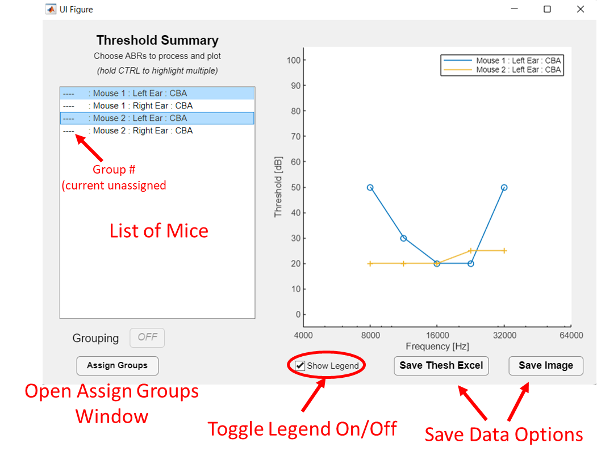
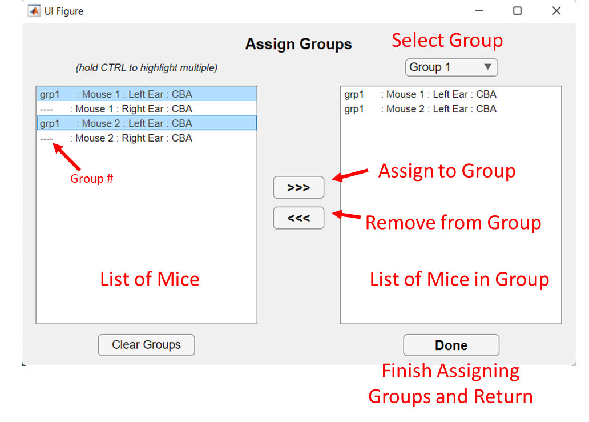

# Documentation

## Selecting Mice
The `AcousticPlotter` load screen enable the user to select which mice he/she would like to view and analyize. The user can load either ARF MAT files. If user choses ARF, he/she will only be able to open 1 ARF file. If user chooses MAT, he/she may open multiple mat files. 

  

 
After loading the desired ARF/MAT file(s), the window will display information about all the mice contained in that file. The information displayed will include type of file (ABR/DPOAE), date collected, ID, reference1, reference2, and number of recordings in that experiment.  

To select mice, hold down the ctrl key to select multiple experiments. Either ABR or DPOAE experiments can be selected  but not both . When selection has been made, press the “Select” button.

If user wants to edits their saved matlab files, open the Combine Files GUI (see below).
 

  

## ABRs

In the main plot, the user sees the raw ABR traces. The lists on the left-hand side allows the user to select which mouse and which frequency to view. Note, frequencies may not be the same between mice, depending on what data were collected. Details about the selected mouse are displayed on the bottom-left.

To select a threshold, use the up and down arrows to select the appropriate level. When selected, press enter. Threshold is shown in red with suprathreshold ABRs appearing as solid lines and subthreshold ABRs appearing as dashed lines. 

For other hotkeys see [hotkeys.md](https://github.com/StankovicLab/Acoustic-Plotter/blob/main/hotkeys.md) 

  

 
The user may also want to add a filter to data. Three 5th order Butterworth filters are available to the user: HPF, LPF, Bandpass. Adding filters has no effect on thresholds. When saving as Excel files, the user have the option to save with the added filter or not. This is relevant only for ABRs. The added filter is not saved to .mat files.
 

  

### UPDATE - 1/12/2023

Acousticplotter now offers a built in peak finder. By pressing ‘p’ the ABR peaks will be displayed on plot. This feature is largely based on [ABR Peak Analaysis Software](https://www.masseyeandear.org/research/otolaryngology/eaton-peabody-laboratories/engineering-core) written by Ken Hancock of the Eaton Peabody Laboratories. Most of the functionality is similar to that software  in terms of finding and editing peaks and nodes. A new save feature become available to export peak and nodes to an excel sheet. Both peaks and nodes have to determined for save function to work.

  

## DPOAEs

In the main window, the user sees the raw DPOAE spectrums. Like the ABR window, the lists on the left-hand side allows the user to select which mouse and which frequency to view. Details about the selected mouse are displayed on the bottom-left. Two additional plots are also displayed in the DPOAE window. The top-right plot displays a zoomed in image of the spectra, at threshold, centered around the DP. The bottom-right plot displays the amplitudes of F1, F2, DP, and noise floor as a function of stimulus level. 

To select a threshold, use the up and down arrows to select the appropriate level. When selected, press enter. Threshold is shown in red with suprathreshold ABRs appearing as solid lines and subthreshold ABRs appearing as dashed lines. 

Data can be saved either as a Matlab file or in an excel sheet. For Matlab files, data will be saved as 2 structures, “details” which contain all the raw data along with details about each mouse and “thresh” which contains all the threshold data.

For other hotkeys see [hotkeys.md](https://github.com/StankovicLab/Acoustic-Plotter/blob/main/hotkeys.md) 
 

  

## Thresholds

To automatically calculate thresholds, click on the “Auto Threshold” button. Depending on how many mice were selected, it may take some time to automatically find thresholds. This is a longer process for ABRs than for DPOAEs. For ABRs, thresholds are determined using a method of cross correlation described by [Suthakar & Liberman 2019](https://doi.org/10.1016/j.heares.2019.107782). For DPOAEs, thresholds are determined when DP's are greater than 3x the standard deviation above the mean, explained by [Bartho et al. 2020](https://github.com/CDTbot/CDTbot). It is highly advised that the user go through all the data to determine if they agree or disagree with the automatically selected threshold. If the user does not agree with the automatically selected threshold, he/she may edit the threshold by using the up and down keys followed by “enter”.  IT IS HIGHLY RECOMMENDED THAT THE USER TO CHECK ALL THRESHOLDS 
 

  

## Threshold Summary

To view and compare thresholds across animals and frequencies, open the Threshold Summary window.  The main plot in this window displays thresholds as a function of frequency. Multiple animals can be selected by holding the ctrl key.

  

 
To group mice in up to 4 groups, select the Assign Groups button. The Assign Groups window will open allowing the user to group animals.  

  

Once groups have been assigned, additional features will be available in the Threshold Summary window. Here the user will now be able to compare the average (mean) between groups by selecting which groups to compare using the checkboxes above the plot. Individual mice may also be viewed by selecting them as before, however, they will now take on the group color. Additionally, the user can select either Standard Deviation (STD) error bars or Standard Error (STE) user bars. STE = STD/sqrt(#mice). 

The saving options allow the user to either save the image or the threshold and group data as an excel file
 

  

## Saving

Data can be saved as an Excel or Matlab file. Matlab files can be reloaded into `AcousticPlotter` to continue working on at a later point. Thresholds are also saved in both Excel and Matlab files

When saving images, the user has the option to save as PNG, JPEG, PDF, Matlab Fig, or SVG

## Combine Files GUI

If the user has multiple files they would like to edit, combine, delete bad trials, or combine trials, use the Combine Files GUI. This GUI will only accept matlab files so before using it, user must convert ARF files to MAT files in main GUI or by using the script `convertARFtoMAT.m`. Once data are loaded, user will see data displayed in a data-tree like format which is organized by File -> Mouse -> Frequency -> Levels (Levels is only to provide the user with level information, nothing can be modified at this level). 

  

To move files, select files to move. Based on which part of the data-tree user selects, those data will be moved to the new file. 
 

  

To delete parts from the new file, selected parts to delete and press ‘delete’ button.

To move a frequency, a frequency and a destination must both be selected

  

Press the ‘Save’ button when edits complete. Will save as a new MAT file that can be opened in the base GUI.

---

It is highly recommended to save all work as MAT files as MAT files will save thresholds and peaks in addition to raw data. Loading a MAT file will also load any saved thresholds and peaks.

---

For reporting bugs or any other inquiries, please contact Stephen McInturff at stephen_mcinturff@stanford.edu 

